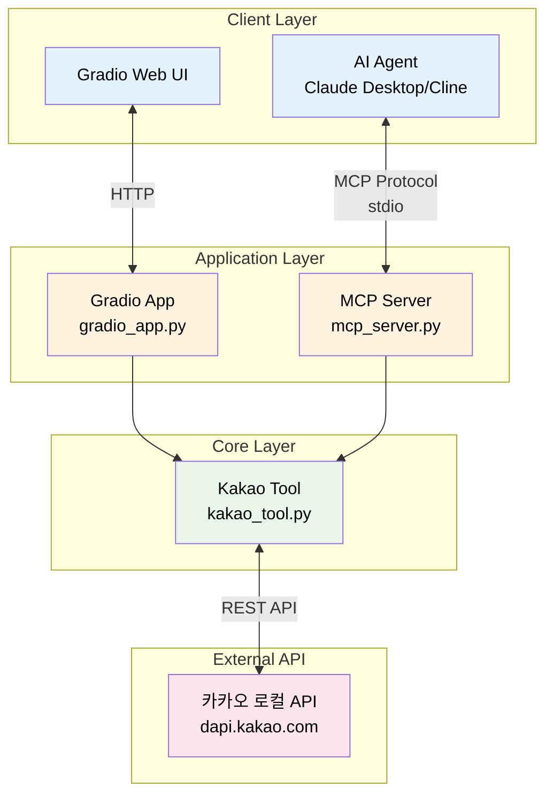
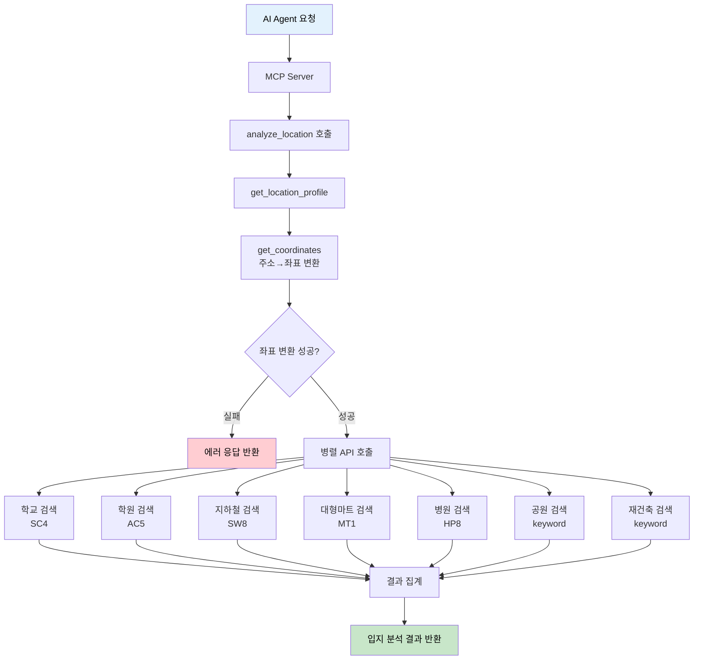
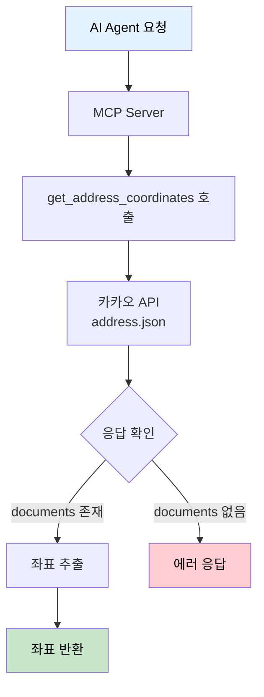
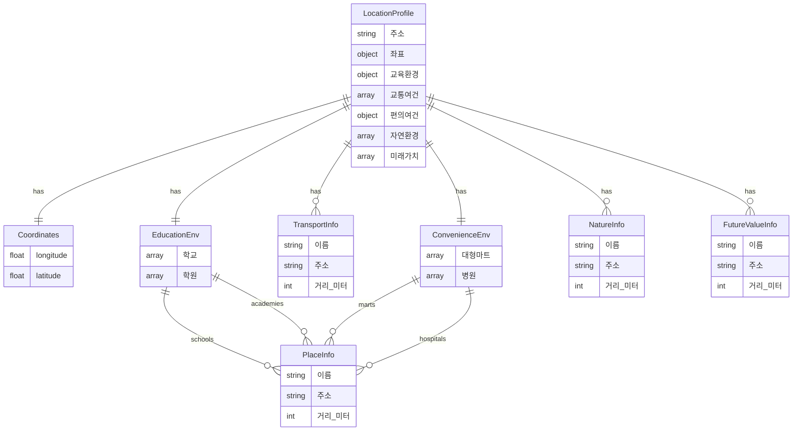
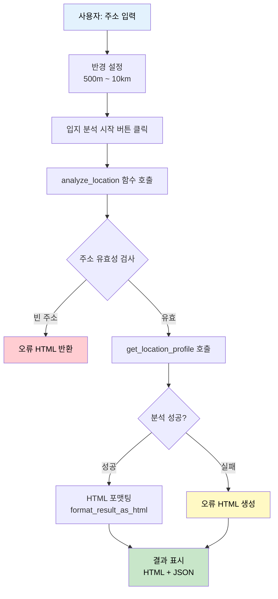
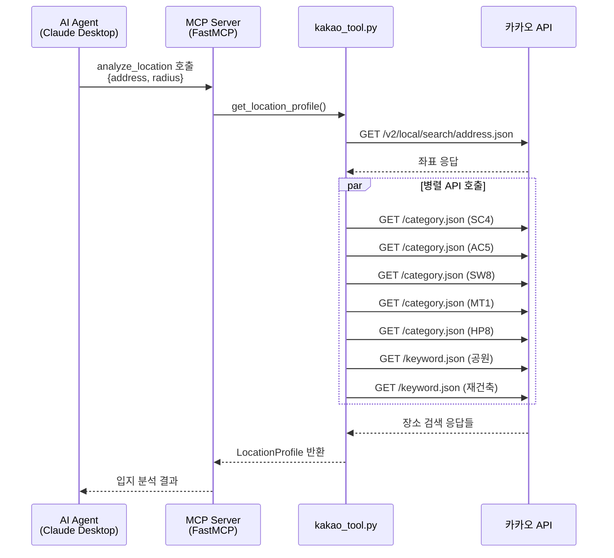
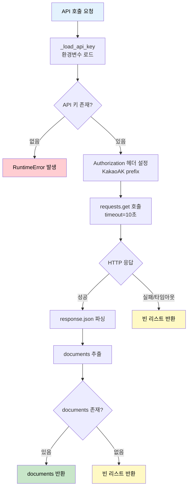

# 부동산 입지 분석 시스템 API & Data Flow 문서

> 최종 업데이트: 2026-02-03
> Base URL: `http://localhost:7860` (Gradio) / MCP Server (stdio)

---

## 목차

1. [개요](#1-개요)
2. [API 엔드포인트](#2-api-엔드포인트)
3. [데이터](#3-데이터)
4. [플로우 다이어그램](#4-플로우-다이어그램)
5. [에러 처리](#5-에러-처리)
6. [부록](#6-부록)

---

<!-- SECTION:OVERVIEW:START -->
## 1. 개요

### 1.1 시스템 아키텍처



### 1.2 기술 스택

| 구분 | 기술 | 버전 |
|-----|------|-----|
| Language | Python | 3.10+ |
| Web Framework | Gradio | 5.0.0 |
| MCP Framework | FastMCP (mcp) | 0.9.0+ |
| HTTP Client | requests | 2.31.0+ |
| 환경변수 관리 | python-dotenv | 1.0.0+ |

### 1.3 외부 서비스

| 서비스 | 용도 | 엔드포인트 |
|-------|------|-----------|
| 카카오 로컬 API | 주소 검색, 장소 검색 | `https://dapi.kakao.com` |

### 1.4 포트 정보

| 서비스 | 포트 | 설명 |
|-------|------|------|
| Gradio Web App | 7860 | 웹 인터페이스 |
| MCP Server | stdio | AI 에이전트용 MCP 프로토콜 |
<!-- SECTION:OVERVIEW:END -->

---

<!-- SECTION:API:START -->
## 2. API 엔드포인트

> **범례**: 🔧 MCP Tool | 📚 MCP Resource | 🌐 External API

### 2.1 요약 테이블

<!-- API:SUMMARY:START -->
| 유형 | 엔드포인트/도구명 | 설명 |
|------|------------------|------|
| 🔧 MCP Tool | `analyze_location` | 주소의 종합 입지 분석 |
| 🔧 MCP Tool | `get_address_coordinates` | 주소를 좌표로 변환 |
| 📚 MCP Resource | `config://api-info` | MCP 서버 API 정보 |
| 📚 MCP Resource | `config://usage-examples` | 사용 예시 |
| 🌐 Kakao API | `/v2/local/search/address.json` | 주소 → 좌표 변환 |
| 🌐 Kakao API | `/v2/local/search/category.json` | 카테고리별 장소 검색 |
| 🌐 Kakao API | `/v2/local/search/keyword.json` | 키워드 장소 검색 |
<!-- API:SUMMARY:END -->

### 2.2 상세 API

<!-- API:DETAIL:START -->

---

#### 🔧 MCP Tool: `analyze_location`

> 주어진 주소를 기준으로 주변의 교육환경, 교통여건, 편의시설, 자연환경, 미래가치 등을 종합적으로 분석합니다.

**Flow:**



**Request:**

```json
{
    "address": "서울시 강남구 역삼동",
    "radius": 3000
}
```

| 필드 | 타입 | 필수 | 설명 | 제약조건 |
|-----|------|-----|------|---------|
| address | string | O | 분석할 주소 | - |
| radius | int | X | 검색 반경(미터) | 기본값: 3000 |

**Response (Success):**

```json
{
    "주소": "서울시 강남구 역삼동",
    "좌표": {
        "longitude": 127.0365,
        "latitude": 37.5000
    },
    "교육환경": {
        "학교": [
            {"이름": "역삼초등학교", "주소": "서울 강남구...", "거리(미터)": 250}
        ],
        "학원": [
            {"이름": "메가스터디", "주소": "서울 강남구...", "거리(미터)": 150}
        ]
    },
    "교통여건": [
        {"이름": "역삼역", "주소": "서울 강남구...", "거리(미터)": 300}
    ],
    "편의여건": {
        "대형마트": [...],
        "병원": [...]
    },
    "자연환경": [...],
    "미래가치": [...]
}
```

| 필드 | 타입 | 설명 |
|-----|------|------|
| 주소 | string | 입력한 주소 |
| 좌표 | object | 위도/경도 좌표 |
| 교육환경 | object | 학교, 학원 정보 (각 최대 3개) |
| 교통여건 | array | 지하철역 정보 (최대 3개) |
| 편의여건 | object | 대형마트, 병원 정보 |
| 자연환경 | array | 공원 정보 (최대 3개) |
| 미래가치 | array | 재건축 정보 (최대 3개) |

---

#### 🔧 MCP Tool: `get_address_coordinates`

> 주소를 위도/경도 좌표로 변환합니다.

**Flow:**



**Request:**

```json
{
    "address": "서울시 강남구 테헤란로 427"
}
```

| 필드 | 타입 | 필수 | 설명 |
|-----|------|-----|------|
| address | string | O | 변환할 주소 |

**Response (Success):**

```json
{
    "longitude": 127.0365,
    "latitude": 37.5000
}
```

**Response (Error):**

```json
{
    "error": "좌표를 찾을 수 없습니다.",
    "주소": "잘못된주소"
}
```

---

#### 📚 MCP Resource: `config://api-info`

> MCP 서버의 API 정보를 제공합니다.

**Response:**

```json
{
    "서버명": "부동산 입지 분석 서버",
    "버전": "1.0.0",
    "설명": "카카오 로컬 API를 활용한 부동산 입지 분석 도구",
    "도구": [...],
    "분석항목": {
        "교육환경": ["학교", "학원"],
        "교통여건": ["지하철역", "버스정류장"],
        "편의여건": ["대형마트", "병원"],
        "자연환경": ["공원"],
        "미래가치": ["재건축"]
    }
}
```

---

#### 📚 MCP Resource: `config://usage-examples`

> MCP 도구 사용 예시를 제공합니다.

**Response:**

```json
{
    "예시1": {
        "설명": "강남역 주변 입지 분석 (기본 반경 3km)",
        "도구": "analyze_location",
        "입력": {"address": "서울시 강남구 역삼동"}
    },
    "예시2": {
        "설명": "도곡동 주변 5km 반경 입지 분석",
        "도구": "analyze_location",
        "입력": {"address": "서울시 강남구 도곡동 527", "radius": 5000}
    }
}
```

---

#### 🌐 Kakao API: `/v2/local/search/address.json`

> 주소를 좌표로 변환하는 카카오 로컬 API

**Internal Usage:** `get_coordinates()` 함수에서 사용

**Request:**

| 파라미터 | 타입 | 설명 |
|---------|------|------|
| query | string | 검색할 주소 |

**Response:**

```json
{
    "documents": [
        {
            "x": "127.0365",
            "y": "37.5000",
            "address_name": "서울 강남구 역삼동"
        }
    ]
}
```

---

#### 🌐 Kakao API: `/v2/local/search/category.json`

> 카테고리 코드로 주변 장소를 검색하는 카카오 로컬 API

**Internal Usage:** `_search_category()` 함수에서 사용

**카테고리 코드:**

| 코드 | 분류 | 용도 |
|------|------|------|
| SC4 | 학교 | 교육환경 - 학교 |
| AC5 | 학원 | 교육환경 - 학원 |
| SW8 | 지하철역 | 교통여건 |
| MT1 | 대형마트 | 편의여건 - 마트 |
| HP8 | 병원 | 편의여건 - 병원 |

**Request:**

| 파라미터 | 타입 | 설명 |
|---------|------|------|
| category_group_code | string | 카테고리 코드 |
| x | float | 경도 |
| y | float | 위도 |
| radius | int | 검색 반경(미터) |
| size | int | 결과 개수 (최대 15) |

---

#### 🌐 Kakao API: `/v2/local/search/keyword.json`

> 키워드로 주변 장소를 검색하는 카카오 로컬 API

**Internal Usage:** `_search_keyword()` 함수에서 사용

**사용 키워드:**
- `"공원"` → 자연환경
- `"재건축"` → 미래가치

**Request:**

| 파라미터 | 타입 | 설명 |
|---------|------|------|
| query | string | 검색 키워드 |
| x | float | 경도 |
| y | float | 위도 |
| radius | int | 검색 반경(미터) |
| size | int | 결과 개수 (최대 15) |

<!-- API:DETAIL:END -->

<!-- SECTION:API:END -->

---

<!-- SECTION:DATA:START -->
## 3. 데이터

### 3.1 데이터 구조 다이어그램

<!-- DATA:ER:START -->

<!-- DATA:ER:END -->

### 3.2 스키마 상세

<!-- DATA:TABLES:START -->

#### LocationProfile (입지 분석 결과)

> `get_location_profile()` 함수의 반환 타입

| 필드 | 타입 | 필수 | 설명 |
|-----|------|-----|------|
| 주소 | string | O | 입력한 주소 |
| 좌표 | Coordinates \| null | O | 좌표 정보 (변환 실패 시 null) |
| 메시지 | string | X | 에러 발생 시 메시지 |
| 교육환경 | EducationEnv | X | 학교/학원 정보 |
| 교통여건 | PlaceInfo[] | X | 지하철역 정보 |
| 편의여건 | ConvenienceEnv | X | 마트/병원 정보 |
| 자연환경 | PlaceInfo[] | X | 공원 정보 |
| 미래가치 | PlaceInfo[] | X | 재건축 정보 |

---

#### Coordinates (좌표)

| 필드 | 타입 | 설명 |
|-----|------|------|
| longitude | float | 경도 (x) |
| latitude | float | 위도 (y) |

---

#### PlaceInfo (장소 정보)

> 모든 장소 검색 결과의 공통 구조

| 필드 | 타입 | 설명 |
|-----|------|------|
| 이름 | string | 장소명 (place_name) |
| 주소 | string | 도로명 주소 또는 지번 주소 |
| 거리(미터) | int | 기준 좌표로부터의 거리 |

**정렬 규칙:** 거리 오름차순, 최대 3개 반환

---

#### EducationEnv (교육환경)

| 필드 | 타입 | 설명 |
|-----|------|------|
| 학교 | PlaceInfo[] | 카테고리 SC4 검색 결과 |
| 학원 | PlaceInfo[] | 카테고리 AC5 검색 결과 |

---

#### ConvenienceEnv (편의여건)

| 필드 | 타입 | 설명 |
|-----|------|------|
| 대형마트 | PlaceInfo[] | 카테고리 MT1 검색 결과 |
| 병원 | PlaceInfo[] | 카테고리 HP8 검색 결과 |

<!-- DATA:TABLES:END -->

<!-- SECTION:DATA:END -->

---

<!-- SECTION:FLOW:START -->
## 4. 플로우 다이어그램

<!-- FLOW:LIST:START -->

### 4.1 Gradio 웹 앱 사용자 흐름

> 웹 인터페이스를 통한 입지 분석 요청 흐름



**핵심 포인트:**
- Enter 키 또는 버튼 클릭으로 분석 시작
- HTML과 JSON 두 가지 형식으로 결과 제공
- JSON 결과는 접을 수 있는 Accordion 컴포넌트로 표시

---

### 4.2 MCP 서버 도구 호출 흐름

> AI 에이전트가 MCP 프로토콜을 통해 도구를 호출하는 흐름



**핵심 포인트:**
- MCP 프로토콜은 stdio 기반 통신
- 카카오 API 호출 시 10초 타임아웃 설정
- 각 카테고리별 최대 15개 조회 후 거리순 3개 선별

---

### 4.3 카카오 API 호출 내부 흐름

> `_call_kakao()` 함수의 HTTP 요청 처리 흐름



**핵심 포인트:**
- API 키는 `KAKAO_REST_API_KEY` 환경변수에서 로드
- 모든 요청에 `KakaoAK {API_KEY}` 형식의 Authorization 헤더 필요
- 타임아웃 10초, 응답 실패 시 빈 리스트로 graceful degradation

---

### 4.4 장소 검색 결과 처리 흐름

> `_format_places()` 함수의 데이터 가공 흐름


**데이터 변환 규칙:**
- `place_name` → `이름`
- `road_address_name` 또는 `address_name` → `주소`
- `distance` → `거리(미터)` (int 변환)

<!-- FLOW:LIST:END -->

<!-- SECTION:FLOW:END -->

---

<!-- SECTION:ERROR:START -->
## 5. 에러 처리

### 5.1 HTTP 상태 코드 (카카오 API)

| 코드 | 상태 | 설명 | 조치 |
|-----|------|------|-----|
| 200 | OK | 성공 | - |
| 400 | Bad Request | 잘못된 요청 파라미터 | 요청 파라미터 확인 |
| 401 | Unauthorized | 인증 실패 | API 키 확인 |
| 403 | Forbidden | 권한 없음 | API 키 권한 확인 |
| 429 | Too Many Requests | 요청 한도 초과 | 잠시 후 재시도 |
| 500 | Server Error | 카카오 서버 오류 | 잠시 후 재시도 |

### 5.2 애플리케이션 에러 케이스

<!-- ERROR:CUSTOM:START -->
| 에러 상황 | 원인 | 반환 형태 | 조치 |
|----------|------|----------|-----|
| API 키 미설정 | `KAKAO_REST_API_KEY` 환경변수 없음 | `RuntimeError` 발생 | `.env` 파일에 API 키 설정 |
| 좌표 변환 실패 | 존재하지 않는 주소 | `{"좌표": null, "메시지": "좌표를 찾지 못했습니다."}` | 주소 형식 확인 |
| 주소 미입력 | 빈 문자열 입력 | `{"error": "주소를 입력해주세요."}` | 유효한 주소 입력 |
| API 타임아웃 | 네트워크 지연 | 해당 항목 빈 배열 반환 | 네트워크 상태 확인 |
| 검색 결과 없음 | 반경 내 장소 없음 | 해당 항목 빈 배열 반환 | 검색 반경 확대 |
<!-- ERROR:CUSTOM:END -->

### 5.3 에러 응답 형식

**MCP 도구 에러 응답:**

```json
{
    "error": "에러 메시지",
    "주소": "입력한 주소",
    "메시지": "입지 분석 중 오류가 발생했습니다."
}
```

**Gradio 앱 에러 HTML:**

```html
<div style="padding: 20px; background-color: #f8d7da; border-radius: 8px;">
    <h3 style="color: #721c24;">오류 발생</h3>
    <p>에러 메시지</p>
    <p><small>카카오 API 키가 설정되어 있는지 확인해주세요.</small></p>
</div>
```
<!-- SECTION:ERROR:END -->

---

<!-- SECTION:APPENDIX:START -->
## 6. 부록

### A. 환경 변수

<!-- APPENDIX:ENV:START -->
| 변수명 | 설명 | 기본값 | 필수 |
|-------|------|-------|-----|
| KAKAO_REST_API_KEY | 카카오 REST API 키 | - | O |
<!-- APPENDIX:ENV:END -->

### B. 파일 구조

```
real-estate-location-analyzer/
├── app.py                    # HuggingFace Spaces 엔트리포인트
├── requirements.txt          # Python 의존성
├── .env.example              # 환경변수 예시
├── src/
│   ├── __init__.py
│   ├── mcp_server.py         # MCP 서버 (FastMCP)
│   ├── gradio_app.py         # Gradio 웹 앱
│   └── tools/
│       ├── __init__.py
│       └── kakao_tool.py     # 카카오 API 연동 도구
└── docs/
    ├── API_FLOW.md           # 본 문서
    └── MCP_SETUP.md          # MCP 설정 가이드
```

### C. 카카오 API 키 발급 방법

1. [카카오 Developers](https://developers.kakao.com/) 접속
2. 로그인 후 "내 애플리케이션" 메뉴 진입
3. "애플리케이션 추가하기" 클릭
4. 앱 이름 입력 후 생성
5. "앱 키" 메뉴에서 **REST API 키** 복사
6. `.env` 파일에 `KAKAO_REST_API_KEY=복사한키` 형식으로 저장

### D. 변경 이력

<!-- APPENDIX:HISTORY:START -->
| 날짜 | 버전 | 변경 내용 | 작성자 |
|-----|------|----------|-------|
| 2026-02-03 | 1.0.0 | 최초 작성 | - |
<!-- APPENDIX:HISTORY:END -->

<!-- SECTION:APPENDIX:END -->
